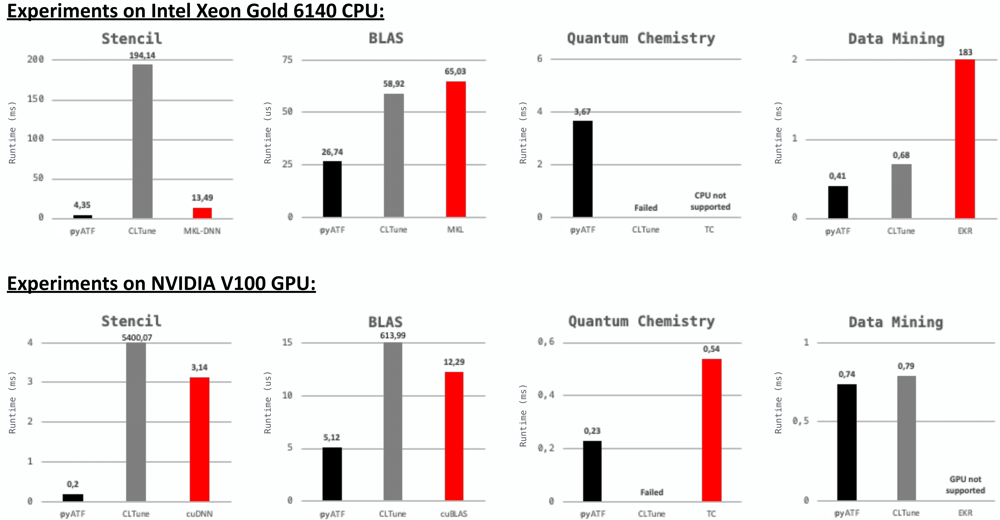

# pyATF: The Auto-Tuning Framework (ATF) in Python

Auto-Tuning Framework (ATF) is a generic, general-purpose auto-tuning approach that automatically finds well-performing values of performance-critical parameters (a.k.a. tuning parameters), such as sizes of tiles and numbers of threads. 
ATF works for programs written in arbitrary programming languages and belonging to arbitrary application domains, and it allows tuning for arbitrary objectives (e.g., high runtime performance and/or low energy consumption).

A major feature of ATF is that it supports auto-tuning programs whose tuning parameters have *interdependencies* among them, e.g., the value of one tuning parameter has to be smaller than the value of another tuning parameter.
For this, ATF introduces novel process to *generating*, *storing*, and *exploring* the search spaces of interdependent tuning parameters (discussed in detail [here](https://dl.acm.org/doi/abs/10.1145/3427093)).

ATF comes with easy-to-use user interfaces to make auto-tuning appealing also to common application developers.
The Interfaces are based on either: 
  1. *Domain-Specific Language (DSL)*, for auto-tuning at compile time (a.k.a. offline tuning) (discussed [here](https://onlinelibrary.wiley.com/doi/full/10.1002/cpe.4423?casa_token=FO9i0maAi_MAAAAA%3AwSOYWsoqfLqcbazsprmzKkmI5msUCY4An5A7CCwi-_V8u10VdpgejcWuiTwYhWnZpaCJZ3NmXt86sg)); 
  2. *General Purpose Language (GPL)*, for auto-tuning at runtime (a.k.a. online tuning), e.g., of *C++ programs* (referred to as [cppATF](todo), and discussed [here](https://ieeexplore.ieee.org/abstract/document/8291912)) or *Python programs* (referred to as [pyATF](todo)).

**This repository contains *pyATF*, i.e., ATF with its GPL-based *Python interface*.**

## Documentation

The full documentation is available [here](https://mdh-project.gitlab.io/pyatf).

## Installation

pyATF requires Python 3.9+ and can be installed using `pip`:

    pip install pyatf

pyATF's pre-implemented OpenCL and CUDA cost functions require additional packages to be installed:

- OpenCL cost function:

      pip install numpy pyopencl

  For the OpenCL cost function, a matching OpenCL runtime is also required, e.g., for Intel CPUs:

      pip install intel-opencl-rt

- CUDA cost function:

      pip install numpy cuda-python

## Example Usage

We illustrate the basic usage of pyATF by auto-tuning the `saxpy` OpenCL kernel of the [CLBlast](https://github.com/CNugteren/CLBlast) library, based on pyATF's GPL-based C++ user interface.

The kernel is implemented in CLBlast as follows:

```c
__kernel void saxpy( const int N, const float a, const __global float* x, __global float* y )
{
    for( int w = 0 ; w < WPT ; ++w ) 
    {
        const int index = w * get_global_size(0) + get_global_id(0);
        y[ index ] += a * x[ index ];
    }
}
```

It takes as inputs: the input size `N`, a floating point number `a`, and two `N`-sized vectors `x` and `y` of floating point numbers. 
The kernel computes for all $`i\in[1,\texttt{N}]_\mathbb{N}`$:

    y[ i ] = a * x[ i ] + y[ i ] 
For simplicity, we removed in the kernel switching between single and double precision floating point numbers, as well as using OpenCL's vector data types.

To auto-tune a program with pyATF, the programmer has to perform three steps, as briefly outlined in the following.
The complete pyATF code for `saxpy` is available [here](examples/full_examples/opencl__saxpy/opencl__saxpy.py).


### Step 1: Generate the Search Space

pyATF automatically generates the search space for the user. 
For this, the user describes the space using tuning parameters, which are in this example:

1. `WPT` (*Work Per Thread*) -- a parameter in the interval $`[1,\texttt{N}]_\mathbb{N}`$ that has to divide the input size `N`:

```python
WPT = TP( 'WPT', Interval( 1,N ), lambda WPT: N % WPT == 0 )
```


2. `LS` (*Local Size*) -- a parameter in the interval $`[1,\texttt{N}]_\mathbb{N}`$ that has to divide the global size `N/WPT`:

```python
LS = TP( 'LS', Interval( 1,N ), lambda WPT, LS: (N / WPT) % LS == 0 )
```

The pyATF user can set arbitrary constraints on tuning parameters.
For this, pyATF allows using any arbitrary, user-defined Python lambda as constraint function that takes as input a value within tuning parameter's range and returns either `true` (iff the constraint is satisfied) or `false` (iff the constraint is not satisfied). 

Interdependencies among tuning parameters are expressed in pyATF via constraints. For this, the constraint function is defined based on tuning parameters (which are defined in the constraint's function definition as parameters and used in its body as variables). For example, the constraint function of parameter LS defines an additional parameter WPT to express that parameter LS has to divide the global size N/WPT. Note that a constraint's parameter name has to exactly match the name of the corresponding tuning parameter to express interdependencies.

pyATF's parameter constraints are described in detail [here](https://ieeexplore.ieee.org/abstract/document/8291912).


### Step 2: Implement a Cost Function

For high flexibility, the pyATF user can use any arbitrary, self-implemented cost function. 
pyATF allows as cost function any arbitrary Python function that takes as input a configuration of tuning parameters and returns a value for which operator `<` is defined.
pyATF interprets the cost function’s return value (e.g., program’s runtime) as the cost that has to be minimized during the auto-tuning process.

For user’s convenience, pyATF provides pre-implemented cost functions for auto-tuning OpenCL and CUDA kernels in terms of runtime performance, because minimizing the runtime of OpenCL and CUDA applications is becoming increasingly important in the autotuning community.

For our `saxpy` example, we use pyATF's pre-implemented OpenCL cost function `opencl.CostFunction`, as follows:

```python
saxpy_kernel = opencl.Kernel( opencl.source(saxpy_kernel_as_string), 'saxpy' )  # kernel's code & name

cf_saxpy = opencl.CostFunction( saxpy_kernel ).platform_id( 0 )                                \ # OpenCL platform id
                                              .device_id( 0 )                                  \ # OpenCL device id
                                              .inputs( np.int32( N )                        ,    # N
                                                       np.float32(np.random.random())       ,    # a
                                                       np.random.rand(N).astype(np.float32) ,    # x
                                                       np.random.rand(N).astype(np.float32) )  \ # y
                                              .global_size( lambda WPT, LS: N/WPT )            \ # OpenCL global size                                   
                                              .local_size( lambda LS: LS )                       # OpenCL local size                                   

```


We first define the kernel straightforwardly as an pyATF OpenCL kernel object `opencl.Kernel`.
Afterwards, we construct an pyATF OpenCL cost function object of type `opencl.CostFunction`, which we customize with:
1) target device's OpenCL platform and device id
2) the kernel's inputs, which are in this example: the input size `N`, a random floating point number for `a` (random data is the default input in auto-tuning), and two `N`-sized buffers for `x` and `y` that are also filled with random floating point numbers;
3) the OpenCL global and local size, which we chose as: `N/WPT` (global size) and `LS` (local size) -- pyATF allows defining both sizes as Python lambdas that may contain tuning parameters in their definition for high expressivity.

Correctness can be optionally validated in pyATF via function `check_result( gold_value )` which checks the `i`-th buffer against a NumPy array `gold_value`.
Alternatively, the user can use instead of parameter `gold_value` a Python lambda `gold_function` that implements the computation of *gold* (e.g., when random data is used), as demonstrated [here](examples/feature_demonstration/result_check/result_check.py).


### Step 3: Explore the Search Space

The pyATF user explores the search space by creating an pyATF tuner object and customizing it with the *tuning parameters* and a *search technique*:

```python  
tuning_result = Tuner().tuning_parameters( WPT, LS )       \
                       .search_technique( AUCBandit() )    \
                       .tune( cf_saxpy, Evaluations(50) )
```
The tuning is started via function `tune` which takes as input the *cost function* (from Step 2) and an *abort condition* (in this example, testing 50 configurations).
pyATF then automatically explores the search space and returns object `tuning_result` which contains: the best found configuration of tuning parameters, the cost of that configuration, etc.

To reduce tuning time, pyATF allows exploiting actual program computations also for the exploration phase, by allowing the user program to explicitly guide the exploration process.
This is in particular beneficial for iterative applications, where the code part to tune is called repeatedly in the program flow, allowing benefiting from the calls also for exploration.
For this, pyATF provides function `make_step` which is used as an alternative to function `tune`, as demonstrated [here](examples/feature_demonstration/program_guided_tuning/program_guided_tuning.py).


### Search Techniques

pyATF currently provides the following, pre-implemented search techniques:
  
*Basic Search Techniques:*

  1. `Exhaustive` 
  2. `Random` 
  3. `SimulatedAnnealing` 
  4. `DifferentialEvolution` 
  5. `PatternSearch` 
  6. `Torczon` 

*Meta Search Techniques:*

  1. `RoundRobin`
  2. `AUCBandit` (recommended as default)

Further techniques can be easily added to pyATF by implementing a straightforward [interface](atf/search_techniques/search_technique.py).


### Abort Conditions

pyATF currently provides the following, pre-implemented abort conditions:

1. `Duration( timedelta(t) )`: stops exploration after a user-defined time interval `t`; here, `timedelta` is part of Python's [datetime module](https://docs.python.org/3/library/datetime.html) and thus `t` can be `hours=2` or `hours=2,minutes=30`, etc.;

2. `Evaluations( n )`: stops after `n` tested configurations;

3. `Fraction( f )`: stops after `f*S` tested configurations, where `f` is a floating point number in `[0,1]` and `S` the search space size;	

4. `Cost( c )`: stops when a configuration with a cost `<=c` has been found;
	
5. `Speedup( s,timedelta(t) )`: stops when within the last time interval `t` the cost could not be lowered by a factor `>=s`;
		
6. `Speedup( s,n )`: stops when within the last `n` tested configurations the cost could not be lowered by a factor `>=s`.

If no abort condition is set, pyATF uses `Evaluations( S )`, where `S` is the search space size.

To meet complex user requirements, abort conditions can be combined by using the logical operators `And` and `Or`, e.g., `Or( Evaluations(100) , Duration(minutes=5) )` to stop tuning after 100 evaluations or 5 minutes, whichever comes first.

New abort conditions can be easily added to pyATF by implementing the corresponding [interface](atf/abort_conditions/abort_condition.py).


## Experimental Results

We present experimental results (discussed in detail [here](https://dl.acm.org/doi/abs/10.1145/3427093)) for [MDH-based auto-tunable computations](https://ieeexplore.ieee.org/abstract/document/8891668?casa_token=mFNVnD2FYXMAAAAA:1DvXQy-Rl1Tm2eiYjaImBEylR0u-eHm-TbtyRs_yIgTdPKVpe5NhsPS-H414i0_ToRfVZyBdexsB) from popular domains:
*Stencil*, 
*BLAS* (Basic Linear Algebra Subroutines), 
*Quantum Chemistry*, and 
*Data Mining*.
In particular, we show that pyATF is able to auto-tune the computations to higher performance than [CLTune](https://github.com/CNugteren/CLTune) which is an auto-tuning approach that also supports interdependencies among tuning parameters:

<br>



<br>

The figure shows runtimes (lower is better) of [implementations](https://ieeexplore.ieee.org/abstract/document/8891668?casa_token=mFNVnD2FYXMAAAAA:1DvXQy-Rl1Tm2eiYjaImBEylR0u-eHm-TbtyRs_yIgTdPKVpe5NhsPS-H414i0_ToRfVZyBdexsB) on CPU (top part of the figure) and GPU (bottom part) when auto-tuned with pyATF (black bars) as compared to auto-tuning the implementations using CLTune (gray bars). 
We also compare to well-performing high-performance libraries which are often optimized by hand (red bars): [MKL-DNN v0.21.5](https://oneapi-src.github.io/oneDNN/v0/index.html), [MKL v2020](https://www.intel.com/content/www/us/en/develop/documentation/get-started-with-mkl-for-dpcpp/top.html), [cuDNN v7.6.5](https://developer.nvidia.com/cudnn), [cuBLAS v10.2.](https://developer.nvidia.com/cublas), [Tensor Comprehensions (TC)](https://github.com/facebookresearch/TensorComprehensions), and [EKR](https://dl.acm.org/doi/abs/10.1145/3297280.3297330?casa_token=Dg8tuKQMslUAAAAA:_0zipZ0ancafufunFVr9ygnETPlYpg5vNgNfyAsGxGEYsIWzTbTBF5Nosq6PhYFzOthvFSPPZGaB).


## Citations

Please use the following citation, when referring to ATF's:

1. **Internal Design & Implementation**

```latex
@article{10.1145/3427093, 
  author = {Rasch, Ari and Schulze, Richard and Steuwer, Michel and Gorlatch, Sergei},
  title = {Efficient Auto-Tuning of Parallel Programs with Interdependent Tuning Parameters via Auto-Tuning Framework (ATF)},
  year = {2021},
  issue_date = {March 2021},
  publisher = {Association for Computing Machinery},
  address = {New York, NY, USA},
  volume = {18},
  number = {1},
  issn = {1544-3566},
  url = {https://doi.org/10.1145/3427093},
  doi = {10.1145/3427093},
  journal = {ACM Trans. Archit. Code Optim.},
  month = {jan},
  articleno = {1},
  numpages = {26},
  keywords = {parallel programs, Auto-tuning, interdependent tuning parameters}
}
```

<br>

2) **DSL-Based Interface**

```latex
@article{https://doi.org/10.1002/cpe.4423,
  author = {Rasch, Ari and Gorlatch, Sergei},
  title = {ATF: A generic directive-based auto-tuning framework},
  journal = {Concurrency and Computation: Practice and Experience},
  volume = {31},
  number = {5},
  pages = {e4423},
  keywords = {auto-tuning, CLBlast, CLTune, CUDA, dependent tuning parameters, GEMM, many-core, multi-core, multi-objective auto-tuning, OpenCL, OpenTuner, tuning parameter constraints},
  doi = {https://doi.org/10.1002/cpe.4423},
  url = {https://onlinelibrary.wiley.com/doi/abs/10.1002/cpe.4423},
  eprint = {https://onlinelibrary.wiley.com/doi/pdf/10.1002/cpe.4423},
  note = {e4423 cpe.4423},
  year = {2019}
}
```    

<br>

3. **GPL-Based**:

- *C++ Interface*

```latex
@INPROCEEDINGS{8291912,
  author={Rasch, Ari and Haidl, Michael and Gorlatch, Sergei},
  booktitle={2017 IEEE 19th International Conference on High Performance Computing and Communications; IEEE 15th International Conference on Smart City; IEEE 3rd International Conference on Data Science and Systems (HPCC/SmartCity/DSS)}, 
  title={ATF: A Generic Auto-Tuning Framework}, 
  year={2017},
  volume={},
  number={},
  pages={64-71},
  doi={10.1109/HPCC-SmartCity-DSS.2017.9}
}
```

- *Python Interface*

```
Comming soon!
```
